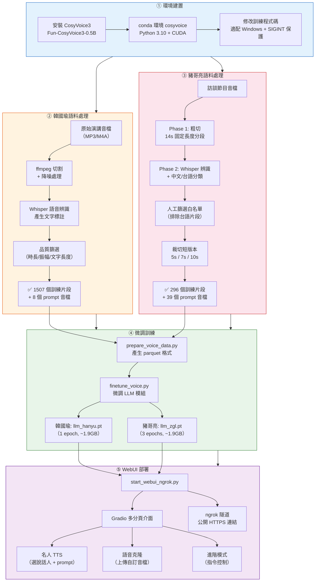

# CosyVoice3 名人語音合成 (Fine-tuned TTS)

> 基於 [FunAudioLLM/CosyVoice](https://github.com/FunAudioLLM/CosyVoice) 的 **Fun-CosyVoice3-0.5B** 模型，微調訓練了**韓國瑜**與**豬哥亮**兩位名人的語音，並搭建了支援 ngrok 公開存取的 Gradio WebUI。

## 專案說明

### 🗺️ 整體流程圖



### 📋 詳細製作過程

#### 第一步：環境建置

1. 從 GitHub clone [FunAudioLLM/CosyVoice](https://github.com/FunAudioLLM/CosyVoice)
2. 建立 conda 環境 `cosyvoice`（Python 3.10），安裝 PyTorch + CUDA
3. 從 ModelScope 下載 `Fun-CosyVoice3-0.5B` 預訓練模型
4. **修改原始碼適配 Windows**：
   - `cosyvoice/bin/train.py`：移除 Linux 專用的多進程設定、加入 `signal.SIG_IGN` 防止 Ctrl+C 中斷訓練
   - `cosyvoice/utils/executor.py`：調整訓練迴圈
   - `cosyvoice/utils/train_utils.py`：修改工具函數

#### 第二步：韓國瑜語料處理

1. **取得原始音檔**：收集韓國瑜公開演講錄音
2. **音檔前處理**：使用 ffmpeg 轉檔、切割為適當長度、正規化音量
3. **語音辨識**：使用 Whisper 模型進行語音轉文字，產生每個片段的 `.txt` 標註
4. **品質篩選**（`find_clips.py`）：
   - 時長過濾：3~8 秒
   - 振幅過濾：最大振幅 > 0.15（排除靜音）
   - 文字長度：≥ 6 個字（排除辨識失敗的片段）
   - 黑名單機制：手動排除 3 個品質差的片段（`clip_0042`、`clip_0171`、`clip_0017`）
5. **最終結果**：1507 個訓練片段 + 8 個精選 prompt 音檔

#### 第三步：豬哥亮語料處理

1. **取得原始音檔**：豬哥亮訪談節目錄音
2. **Phase 1 粗切**（`separate_zgl_phase1.py`）：將長音檔以 14 秒固定長度切割為 296 個片段
3. **Phase 2 辨識**（`separate_zgl_whisper.py`）：使用 Whisper 對每個片段進行語音辨識
4. **難題：台語內容**：
   - 豬哥亮大量使用台語，而 CosyVoice3 與 Whisper 都不支援台語
   - Whisper 會把台語辨識成亂碼或錯誤的中文
   - **解決方案**：人工聆聽，建立 13 個純中文片段的白名單（`whitelist_base`）
5. **裁切短版本**（`trim_zgl_prompts.py`）：
   - 14 秒的片段太長，會導致 CosyVoice 警告「合成文字比 prompt 文字短」
   - 將每個白名單片段裁切為 5s / 7s / 10s 三種長度
   - 文字標註按比例截斷
   - 產生 75 個短版本（25 片段 × 3 種長度）
6. **最終結果**：296 個訓練片段 + 39 個 prompt（13 基礎片段 × 3 長度）

#### 第四步：微調訓練

1. **資料格式轉換**（`prepare_voice_data.py`）：
   - 將 WAV + TXT 轉換為 CosyVoice 要求的 parquet 格式
   - 提取 speech token（語音特徵向量）
   - 提取 speaker embedding（說話人嵌入向量）
2. **LLM 模組微調**（`finetune_voice.py`）：
   - 僅微調 CosyVoice3 的 LLM 模組（不動 flow / hifigan）
   - 韓國瑜：訓練 1 個 epoch → `llm_hanyu.pt`（1930.9 MB）
   - 豬哥亮：訓練 3 個 epoch → `llm_zgl.pt`（1930.9 MB）
   - 硬體：RTX 4070 12GB，訓練時間約數小時
3. **Windows 訓練問題排解**：
   - 加入 `CREATE_NEW_PROCESS_GROUP` 避免子進程被 SIGINT 殺死
   - 加入 `signal.SIG_IGN` 忽略 Ctrl+C 信號，防止訓練中斷
   - ONNX Runtime 僅支援 CPU（不影響 PyTorch CUDA 訓練）

#### 第五步：WebUI 部署

1. **建構 Gradio 介面**（`start_webui_ngrok.py`，約 820 行）：
   - **Tab 1 — 名人 TTS**：選擇說話人（韓國瑜/豬哥亮）→ 選擇 prompt 片段 → 輸入文字 → 生成語音
   - **Tab 2 — 語音克隆**：上傳自訂參考音檔 → 選擇說話人模型 → 生成語音
   - **Tab 3 — 進階模式**：支援 instruct 指令控制語速、情感等
2. **動態說話人切換**（`switch_speaker()`）：
   - 使用 `torch.load()` 載入對應的 `llm_*.pt` 權重
   - 直接覆蓋 `cosyvoice.model.llm` 的 `state_dict`
   - 切換時間 < 2 秒，不需重啟服務
3. **Prompt 自動篩選系統**（`scan_prompts_for_speaker()`）：
   - 啟動時自動掃描 `voice_data/` 下的音檔
   - 根據 Whisper 辨識文字、音檔時長、振幅等自動篩選
   - 支援白名單/黑名單機制
   - 豬哥亮的 prompt 按片段分組，同一句話提供 5s/7s/10s 三種長度可選
4. **ngrok 隧道**：
   - 使用 pyngrok 自動建立 HTTPS 隧道
   - 綁定固定域名 `unferried-milo-unphlegmatically.ngrok-free.dev`
   - 手機、外部電腦都能直接存取

### 🏗️ 系統架構圖

```
┌─────────────────────────────────────────────────┐
│                  使用者 (瀏覽器)                    │
│         手機 / 電腦 / 任何裝置                      │
└──────────────────────┬──────────────────────────┘
                       │ HTTPS
                       ▼
┌──────────────────────────────────────────────────┐
│              ngrok 隧道 (公開連結)                  │
│   unferried-milo-unphlegmatically.ngrok-free.dev │
└──────────────────────┬───────────────────────────┘
                       │ localhost:7860
                       ▼
┌──────────────────────────────────────────────────┐
│            Gradio WebUI (3 個分頁)                 │
│  ┌──────────┐ ┌──────────┐ ┌──────────────┐     │
│  │ 名人 TTS │ │ 語音克隆  │ │   進階模式    │     │
│  └────┬─────┘ └────┬─────┘ └──────┬───────┘     │
│       └────────────┼──────────────┘              │
│                    ▼                             │
│         switch_speaker() 動態切換                 │
│    ┌──────────────┬──────────────┐               │
│    │ llm_hanyu.pt │ llm_zgl.pt   │               │
│    │  (韓國瑜)     │  (豬哥亮)     │               │
│    └──────┬───────┴──────┬───────┘               │
│           └──────┬───────┘                       │
│                  ▼                               │
│     CosyVoice3 Fun-0.5B 推理引擎                  │
│    ┌─────┐  ┌──────┐  ┌────────┐                │
│    │ LLM │→│ Flow  │→│ HiFiGAN │→ 🔊 語音輸出   │
│    └─────┘  └──────┘  └────────┘                │
└──────────────────────────────────────────────────┘
              RTX 4070 (12GB VRAM)
```

### 🎯 做了什麼

1. **語音微調訓練 (Fine-tuning)**
   - 使用 CosyVoice3 的 LLM 模組進行語音微調
   - **韓國瑜**：從演講音檔中切出 1507 個訓練片段，微調產生 `llm_hanyu.pt`
   - **豬哥亮**：從訪談節目中切出 296 個片段（14s 固定長度），微調產生 `llm_zgl.pt`（3 個 epoch）

2. **多說話人 WebUI**
   - 三個分頁：「名人 TTS」、「語音克隆」、「進階模式」
   - 支援即時切換說話人（動態載入不同 LLM 權重）
   - 內建篩選好的 prompt 音檔（韓國瑜 8 個、豬哥亮 39 個）
   - 透過 ngrok 隧道提供公開 HTTPS 連結

3. **語料處理工具鏈**
   - 音檔分離、Whisper 語音辨識、品質篩選
   - 自動裁切不同長度的 prompt 版本（5s / 7s / 10s）
   - 白名單 + 黑名單機制過濾品質不佳的片段

### 📁 新增檔案

| 檔案 | 說明 |
|------|------|
| `start_webui_ngrok.py` | WebUI 主程式（Gradio + ngrok 隧道） |
| `finetune_voice.py` | 語音微調訓練腳本 |
| `trim_zgl_prompts.py` | 將 14s 長片段裁切為 5s/7s/10s 短版 |
| `prepare_voice_data.py` | 語料資料準備腳本 |
| `prepare_speaker_data.py` | 說話人資料準備 |
| `find_clips.py` | 片段品質篩選工具 |
| `separate_zgl.py` | 豬哥亮語料分離（主程式） |
| `separate_zgl_phase1.py` | 豬哥亮語料分離（階段一） |
| `separate_zgl_phase2.py` | 豬哥亮語料分離（階段二） |
| `separate_zgl_whisper.py` | 豬哥亮語料 Whisper 辨識 |
| `my_zero_shot.py` | Zero-shot 測試腳本 |
| `record_prompt.py` | Prompt 音檔錄製工具 |

### 🔧 修改的原始檔案

| 檔案 | 修改內容 |
|------|----------|
| `cosyvoice/bin/train.py` | 適配 Windows 環境、加入 SIGINT 保護 |
| `cosyvoice/utils/executor.py` | 訓練流程調整 |
| `cosyvoice/utils/train_utils.py` | 訓練工具函數修改 |

### 💻 運行環境

- **GPU**: NVIDIA RTX 4070 (12GB VRAM)
- **OS**: Windows
- **Python**: 3.10（conda 環境 `cosyvoice`）
- **模型**: Fun-CosyVoice3-0.5B

### 🚀 使用方式

```bash
# 啟動 WebUI（含 ngrok 公開連結）
conda activate cosyvoice
python start_webui_ngrok.py --port 7860

# 微調訓練（需要先準備好 voice_data 資料夾）
python finetune_voice.py

# 裁切 prompt 短版本
python trim_zgl_prompts.py
```

### ⚠️ 未上傳的大型檔案

以下檔案因體積過大未包含在此 repo 中：
- `pretrained_models/` — CosyVoice3 預訓練模型（需從 ModelScope/HuggingFace 下載）
- `voice_data/` — 訓練語料（韓國瑜 1507 片段、豬哥亮 296+75 片段）
- `finetune_output/` — 微調輸出模型（`llm_hanyu.pt`、`llm_zgl.pt`）
- `raw_audio/` — 原始音檔素材

---

## 以下為原始 CosyVoice README

---

## 👉🏻 CosyVoice 👈🏻

**Fun-CosyVoice 3.0**: [Demos](https://funaudiollm.github.io/cosyvoice3/); [Paper](https://arxiv.org/pdf/2505.17589); [Modelscope](https://www.modelscope.cn/models/FunAudioLLM/Fun-CosyVoice3-0.5B-2512); [Huggingface](https://huggingface.co/FunAudioLLM/Fun-CosyVoice3-0.5B-2512); [CV3-Eval](https://github.com/FunAudioLLM/CV3-Eval)

**CosyVoice 2.0**: [Demos](https://funaudiollm.github.io/cosyvoice2/); [Paper](https://arxiv.org/pdf/2412.10117); [Modelscope](https://www.modelscope.cn/models/iic/CosyVoice2-0.5B); [HuggingFace](https://huggingface.co/FunAudioLLM/CosyVoice2-0.5B)

**CosyVoice 1.0**: [Demos](https://fun-audio-llm.github.io); [Paper](https://funaudiollm.github.io/pdf/CosyVoice_v1.pdf); [Modelscope](https://www.modelscope.cn/models/iic/CosyVoice-300M); [HuggingFace](https://huggingface.co/FunAudioLLM/CosyVoice-300M)

## Highlight🔥

**Fun-CosyVoice 3.0** is an advanced text-to-speech (TTS) system based on large language models (LLM), surpassing its predecessor (CosyVoice 2.0) in content consistency, speaker similarity, and prosody naturalness. It is designed for zero-shot multilingual speech synthesis in the wild.
### Key Features
- **Language Coverage**: Covers 9 common languages (Chinese, English, Japanese, Korean, German, Spanish, French, Italian, Russian), 18+ Chinese dialects/accents (Guangdong, Minnan, Sichuan, Dongbei, Shan3xi, Shan1xi, Shanghai, Tianjin, Shandong, Ningxia, Gansu, etc.) and meanwhile supports both multi-lingual/cross-lingual zero-shot voice cloning.
- **Content Consistency & Naturalness**: Achieves state-of-the-art performance in content consistency, speaker similarity, and prosody naturalness.
- **Pronunciation Inpainting**: Supports pronunciation inpainting of Chinese Pinyin and English CMU phonemes, providing more controllability and thus suitable for production use.
- **Text Normalization**: Supports reading of numbers, special symbols and various text formats without a traditional frontend module.
- **Bi-Streaming**: Support both text-in streaming and audio-out streaming, and achieves latency as low as 150ms while maintaining high-quality audio output.
- **Instruct Support**: Supports various instructions such as languages, dialects, emotions, speed, volume, etc.


## Roadmap

- [x] 2025/12

    - [x] release Fun-CosyVoice3-0.5B-2512 base model, rl model and its training/inference script
    - [x] release Fun-CosyVoice3-0.5B modelscope gradio space

- [x] 2025/08

    - [x] Thanks to the contribution from NVIDIA Yuekai Zhang, add triton trtllm runtime support and cosyvoice2 grpo training support

- [x] 2025/07

    - [x] release Fun-CosyVoice 3.0 eval set

- [x] 2025/05

    - [x] add CosyVoice2-0.5B vllm support

- [x] 2024/12

    - [x] 25hz CosyVoice2-0.5B released

- [x] 2024/09

    - [x] 25hz CosyVoice-300M base model
    - [x] 25hz CosyVoice-300M voice conversion function

- [x] 2024/08

    - [x] Repetition Aware Sampling(RAS) inference for llm stability
    - [x] Streaming inference mode support, including kv cache and sdpa for rtf optimization

- [x] 2024/07

    - [x] Flow matching training support
    - [x] WeTextProcessing support when ttsfrd is not available
    - [x] Fastapi server and client

## Evaluation

| Model | Open-Source | Model Size | test-zh<br>CER (%) ↓ | test-zh<br>SS (%) ↑ | test-en<br>WER (%) ↓ | test-en<br>SS (%) ↑ | test-hard<br>CER (%) ↓ | test-hard<br>SS (%) ↑ |
| :--- | :---: | :---: | :---: | :---: | :---: | :---: | :---: | :---: |
| Human | - | - | 1.26 | 75.5 | 2.14 | 73.4 | - | - |
| Seed-TTS | ❌ | - | 1.12 | 79.6 | 2.25 | 76.2 | 7.59 | 77.6 |
| MiniMax-Speech | ❌ | - | 0.83 | 78.3 | 1.65 | 69.2 | - | - |
| F5-TTS | ✅ | 0.3B | 1.52 | 74.1 | 2.00 | 64.7 | 8.67 | 71.3 |
| Spark TTS | ✅ | 0.5B | 1.2 | 66.0 | 1.98 | 57.3 | - | - |
| CosyVoice2 | ✅ | 0.5B | 1.45 | 75.7 | 2.57 | 65.9 | 6.83 | 72.4 |
| FireRedTTS2 | ✅ | 1.5B | 1.14 | 73.2 | 1.95 | 66.5 | - | - |
| Index-TTS2 | ✅ | 1.5B | 1.03 | 76.5 | 2.23 | 70.6 | 7.12 | 75.5 |
| VibeVoice-1.5B | ✅ | 1.5B | 1.16 | 74.4 | 3.04 | 68.9 | - | - |
| VibeVoice-Realtime | ✅ | 0.5B | - | - | 2.05 | 63.3 | - | - |
| HiggsAudio-v2 | ✅ | 3B | 1.50 | 74.0 | 2.44 | 67.7 | - | - |
| VoxCPM | ✅ | 0.5B | 0.93 | 77.2 | 1.85 | 72.9 | 8.87 | 73.0 |
| GLM-TTS | ✅ | 1.5B | 1.03 | 76.1 | - | - | - | - |
| GLM-TTS RL | ✅ | 1.5B | 0.89 | 76.4 | - | - | - | - |
| Fun-CosyVoice3-0.5B-2512 | ✅ | 0.5B | 1.21 | 78.0 | 2.24 | 71.8 | 6.71 | 75.8 |
| Fun-CosyVoice3-0.5B-2512_RL | ✅ | 0.5B | 0.81 | 77.4 | 1.68 | 69.5 | 5.44 | 75.0 |


## Install

### Clone and install

- Clone the repo
    ``` sh
    git clone --recursive https://github.com/FunAudioLLM/CosyVoice.git
    # If you failed to clone the submodule due to network failures, please run the following command until success
    cd CosyVoice
    git submodule update --init --recursive
    ```

- Install Conda: please see https://docs.conda.io/en/latest/miniconda.html
- Create Conda env:

    ``` sh
    conda create -n cosyvoice -y python=3.10
    conda activate cosyvoice
    pip install -r requirements.txt -i https://mirrors.aliyun.com/pypi/simple/ --trusted-host=mirrors.aliyun.com

    # If you encounter sox compatibility issues
    # ubuntu
    sudo apt-get install sox libsox-dev
    # centos
    sudo yum install sox sox-devel
    ```

### Model download

We strongly recommend that you download our pretrained `Fun-CosyVoice3-0.5B` `CosyVoice2-0.5B` `CosyVoice-300M` `CosyVoice-300M-SFT` `CosyVoice-300M-Instruct` model and `CosyVoice-ttsfrd` resource.

``` python
# modelscope SDK model download
from modelscope import snapshot_download
snapshot_download('FunAudioLLM/Fun-CosyVoice3-0.5B-2512', local_dir='pretrained_models/Fun-CosyVoice3-0.5B')
snapshot_download('iic/CosyVoice2-0.5B', local_dir='pretrained_models/CosyVoice2-0.5B')
snapshot_download('iic/CosyVoice-300M', local_dir='pretrained_models/CosyVoice-300M')
snapshot_download('iic/CosyVoice-300M-SFT', local_dir='pretrained_models/CosyVoice-300M-SFT')
snapshot_download('iic/CosyVoice-300M-Instruct', local_dir='pretrained_models/CosyVoice-300M-Instruct')
snapshot_download('iic/CosyVoice-ttsfrd', local_dir='pretrained_models/CosyVoice-ttsfrd')

# for oversea users, huggingface SDK model download
from huggingface_hub import snapshot_download
snapshot_download('FunAudioLLM/Fun-CosyVoice3-0.5B-2512', local_dir='pretrained_models/Fun-CosyVoice3-0.5B')
snapshot_download('FunAudioLLM/CosyVoice2-0.5B', local_dir='pretrained_models/CosyVoice2-0.5B')
snapshot_download('FunAudioLLM/CosyVoice-300M', local_dir='pretrained_models/CosyVoice-300M')
snapshot_download('FunAudioLLM/CosyVoice-300M-SFT', local_dir='pretrained_models/CosyVoice-300M-SFT')
snapshot_download('FunAudioLLM/CosyVoice-300M-Instruct', local_dir='pretrained_models/CosyVoice-300M-Instruct')
snapshot_download('FunAudioLLM/CosyVoice-ttsfrd', local_dir='pretrained_models/CosyVoice-ttsfrd')
```

Optionally, you can unzip `ttsfrd` resource and install `ttsfrd` package for better text normalization performance.

Notice that this step is not necessary. If you do not install `ttsfrd` package, we will use wetext by default.

``` sh
cd pretrained_models/CosyVoice-ttsfrd/
unzip resource.zip -d .
pip install ttsfrd_dependency-0.1-py3-none-any.whl
pip install ttsfrd-0.4.2-cp310-cp310-linux_x86_64.whl
```

### Basic Usage

We strongly recommend using `Fun-CosyVoice3-0.5B` for better performance.
Follow the code in `example.py` for detailed usage of each model.
```sh
python example.py
```

#### vLLM Usage
CosyVoice2/3 now supports **vLLM 0.11.x+ (V1 engine)** and **vLLM 0.9.0 (legacy)**.
Older vllm version(<0.9.0) do not support CosyVoice inference, and versions in between (e.g., 0.10.x) are not tested.

Notice that `vllm` has a lot of specific requirements. You can create a new env to in case your hardward do not support vllm and old env is corrupted.

``` sh
conda create -n cosyvoice_vllm --clone cosyvoice
conda activate cosyvoice_vllm
# for vllm==0.9.0
pip install vllm==v0.9.0 transformers==4.51.3 numpy==1.26.4 -i https://mirrors.aliyun.com/pypi/simple/ --trusted-host=mirrors.aliyun.com
# for vllm>=0.11.0
pip install vllm==v0.11.0 transformers==4.57.1 numpy==1.26.4 -i https://mirrors.aliyun.com/pypi/simple/ --trusted-host=mirrors.aliyun.com
python vllm_example.py
```

#### Start web demo

You can use our web demo page to get familiar with CosyVoice quickly.

Please see the demo website for details.

``` python
# change iic/CosyVoice-300M-SFT for sft inference, or iic/CosyVoice-300M-Instruct for instruct inference
python3 webui.py --port 50000 --model_dir pretrained_models/CosyVoice-300M
```

#### Advanced Usage

For advanced users, we have provided training and inference scripts in `examples/libritts`.

#### Build for deployment

Optionally, if you want service deployment,
You can run the following steps.

``` sh
cd runtime/python
docker build -t cosyvoice:v1.0 .
# change iic/CosyVoice-300M to iic/CosyVoice-300M-Instruct if you want to use instruct inference
# for grpc usage
docker run -d --runtime=nvidia -p 50000:50000 cosyvoice:v1.0 /bin/bash -c "cd /opt/CosyVoice/CosyVoice/runtime/python/grpc && python3 server.py --port 50000 --max_conc 4 --model_dir iic/CosyVoice-300M && sleep infinity"
cd grpc && python3 client.py --port 50000 --mode <sft|zero_shot|cross_lingual|instruct>
# for fastapi usage
docker run -d --runtime=nvidia -p 50000:50000 cosyvoice:v1.0 /bin/bash -c "cd /opt/CosyVoice/CosyVoice/runtime/python/fastapi && python3 server.py --port 50000 --model_dir iic/CosyVoice-300M && sleep infinity"
cd fastapi && python3 client.py --port 50000 --mode <sft|zero_shot|cross_lingual|instruct>
```

#### Using Nvidia TensorRT-LLM for deployment

Using TensorRT-LLM to accelerate cosyvoice2 llm could give 4x acceleration comparing with huggingface transformers implementation.
To quick start:

``` sh
cd runtime/triton_trtllm
docker compose up -d
```
For more details, you could check [here](https://github.com/FunAudioLLM/CosyVoice/tree/main/runtime/triton_trtllm)

## Discussion & Communication

You can directly discuss on [Github Issues](https://github.com/FunAudioLLM/CosyVoice/issues).

You can also scan the QR code to join our official Dingding chat group.


## Acknowledge

1. We borrowed a lot of code from [FunASR](https://github.com/modelscope/FunASR).
2. We borrowed a lot of code from [FunCodec](https://github.com/modelscope/FunCodec).
3. We borrowed a lot of code from [Matcha-TTS](https://github.com/shivammehta25/Matcha-TTS).
4. We borrowed a lot of code from [AcademiCodec](https://github.com/yangdongchao/AcademiCodec).
5. We borrowed a lot of code from [WeNet](https://github.com/wenet-e2e/wenet).

## Citations

``` bibtex
@article{du2024cosyvoice,
  title={Cosyvoice: A scalable multilingual zero-shot text-to-speech synthesizer based on supervised semantic tokens},
  author={Du, Zhihao and Chen, Qian and Zhang, Shiliang and Hu, Kai and Lu, Heng and Yang, Yexin and Hu, Hangrui and Zheng, Siqi and Gu, Yue and Ma, Ziyang and others},
  journal={arXiv preprint arXiv:2407.05407},
  year={2024}
}

@article{du2024cosyvoice,
  title={Cosyvoice 2: Scalable streaming speech synthesis with large language models},
  author={Du, Zhihao and Wang, Yuxuan and Chen, Qian and Shi, Xian and Lv, Xiang and Zhao, Tianyu and Gao, Zhifu and Yang, Yexin and Gao, Changfeng and Wang, Hui and others},
  journal={arXiv preprint arXiv:2412.10117},
  year={2024}
}

@article{du2025cosyvoice,
  title={CosyVoice 3: Towards In-the-wild Speech Generation via Scaling-up and Post-training},
  author={Du, Zhihao and Gao, Changfeng and Wang, Yuxuan and Yu, Fan and Zhao, Tianyu and Wang, Hao and Lv, Xiang and Wang, Hui and Shi, Xian and An, Keyu and others},
  journal={arXiv preprint arXiv:2505.17589},
  year={2025}
}

@inproceedings{lyu2025build,
  title={Build LLM-Based Zero-Shot Streaming TTS System with Cosyvoice},
  author={Lyu, Xiang and Wang, Yuxuan and Zhao, Tianyu and Wang, Hao and Liu, Huadai and Du, Zhihao},
  booktitle={ICASSP 2025-2025 IEEE International Conference on Acoustics, Speech and Signal Processing (ICASSP)},
  pages={1--2},
  year={2025},
  organization={IEEE}
}
```

## Disclaimer
The content provided above is for academic purposes only and is intended to demonstrate technical capabilities. Some examples are sourced from the internet. If any content infringes on your rights, please contact us to request its removal.
